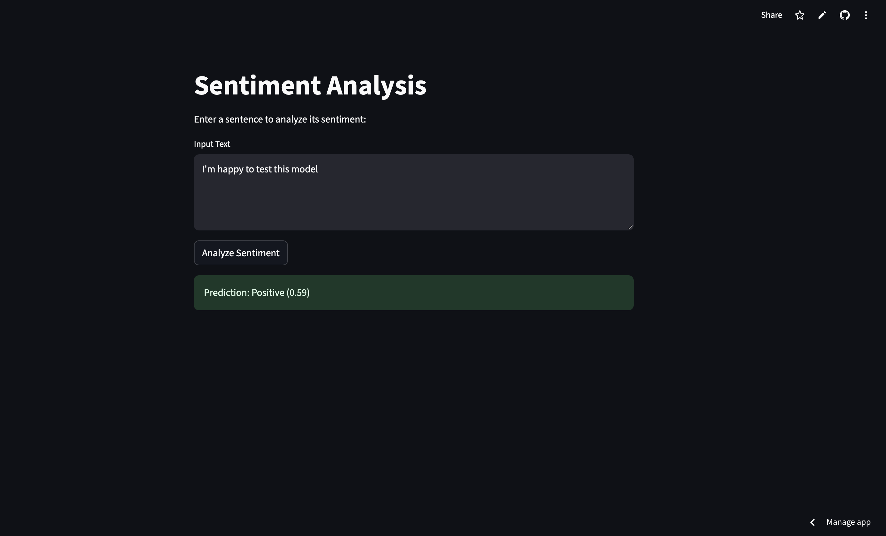

# 🧠 Sentiment Analysis MLOps Pipeline

A full MLOps project for deploying a sentiment analysis model with a **FastAPI** backend and a **Streamlit** frontend, using **CI/CD with GitHub Actions**, and deploying to the cloud.

---

## 📌 Project Overview

This project demonstrates how to operationalize an NLP model for sentiment analysis using modern MLOps practices. It includes:

- 🐍 FastAPI backend serving predictions
- 📊 Streamlit frontend UI
- 🐳 Docker containerization
- 🚀 CI/CD via GitHub Actions
- ☁️ Deployed backend on Render
- 🌐 Deployed frontend on Streamlit Community Cloud

---

## 🖼️ Preview



---

## 📁 Project Structure

```
.
├── backend/                # FastAPI app for prediction
│   ├── app.py              # Main FastAPI app
│   ├── mlflow/model/              # Loaded ML model
│   └── Dockerfile          # Dockerfile for backend
│   └── requirements.txt
├── frontend/               # Streamlit web UI
│   ├── app.py              # Main Streamlit app
│   └── Dockerfile          # Dockerfile for frontend
│   └── requirements.txt
├── test                    # Unit tests
├── mlflow/                 # MLflow artifacts 
├── .github/workflows/      # CI/CD pipelines
│   └── deploy.yml
├── README.md
└── requirements.txt
```

---

## ⚙️ Tech Stack

- Python 3.11
- FastAPI
- Streamlit
- Docker
- GitHub Actions (CI/CD)
- MLflow 
- Render (Backend Deployment)
- Streamlit Community Cloud (Frontend Deployment)

---

## 🚀 Deployment URLs

- 🔗 **Backend (FastAPI)**: https://sentiment-api-n94n.onrender.com
- 🔗 **Frontend (Streamlit)**: https://sentiment-analysis-ui.streamlit.app

---

## ✅ How to Use

1. Clone the repo:
   ```bash
   git clone https://github.com/your-username/sentiment-analysis-mlops.git
   cd sentiment-analysis-mlops
   ```

2. Run locally:
   - **Backend**:
     ```bash
     cd backend
     uvicorn app:app --reload
     ```
   - **Frontend**:
     ```bash
     cd frontend
     streamlit run app.py
     ```

3. Access the frontend and test predictions!

---

## 🔄 CI/CD Pipeline

This project includes a GitHub Actions workflow to:
- Build and push Docker images
- Run tests 
- Deploy automatically to cloud platforms

---

## 🧪 Model Info

- Model `distilbert-base-uncased` (Fine-tuned with HuggingFace Transformers)
- Binary sentiment classification: `positive` / `negative`

---

## 📌 Future Improvements

- Integrate monitoring (e.g., Prometheus + Grafana)
- Serve multiple models using MLflow Registry
- Enable batch predictions and logging

---
